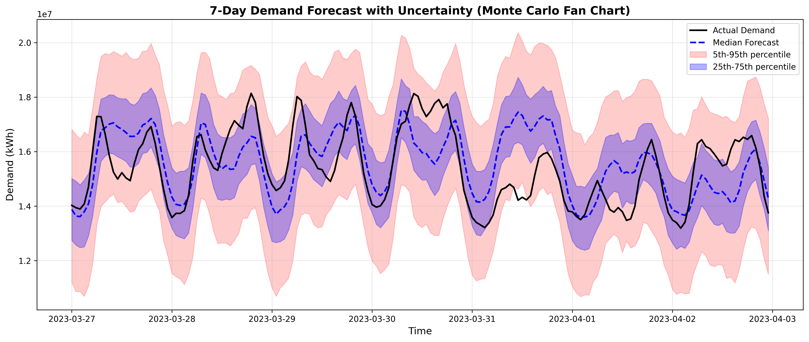

# Ontario Electricity Demand Forecasting  
**Probabilistic Forecasting, Uncertainty Quantification, and Risk Simulation**

## Overview
This project builds a **24-hour to 7-day ahead probabilistic forecasting system** for Ontario’s hourly electricity demand.  
Beyond point forecasts, the model explicitly quantifies **uncertainty**, simulates future demand scenarios via **Monte Carlo methods**, and evaluates **system risk under peak-load stress events**.

The focus is on **model interpretability, uncertainty calibration, and risk-aware decision support**, not black-box accuracy alone.

---

## Data
- **Source:** Ontario hourly electricity demand and hourly average price
- **Frequency:** Hourly
- **Time span:** ~2003–2023
- **Target:** Demand 24 hours ahead

### Data Processing
- Time alignment to a complete hourly grid
- Time-based interpolation for missing timestamps
- Explicit integrity checks (no missing values post-processing)

---

## Feature Engineering
### Temporal Features
- Hour of day (sin / cos encoding)
- Day of week
- Month
- Day of year
- Weekend indicator

### Holiday Features (Ontario-specific)
- Fixed holidays (New Year’s, Canada Day, Christmas, etc.)
- Variable holidays (Family Day, Good Friday, Victoria Day, Labour Day, Thanksgiving)

### Lag & Rolling Statistics
- Demand lags: 1h, 24h, 168h
- Rolling mean & volatility (24h, 168h)
- Price lags and rolling statistics

---

## Modeling Approach

### Baseline
- **Naive lag-24 forecast**
- Serves as a strong seasonal benchmark

### Linear Regression
- Deterministic point forecast
- High interpretability
- Used as a reference model

### Quantile Regression (Core Model)
- Quantiles: **0.1, 0.5, 0.9**
- Produces **prediction intervals**, not just point estimates
- Enables uncertainty-aware downstream analysis

Performance is evaluated using:
- MAE
- RMSE
- Empirical interval coverage

---

## Uncertainty & Risk Modeling

### Monte Carlo Simulation
- Forecast horizon: **7 days (168 hours)**
- Simulations: **1000 paths**
- Distribution inferred from quantile spread
- Generates full demand trajectories

### Risk Metrics
- Peak demand distribution
- Probability of exceeding critical thresholds
- Worst-case (top 1%) stress events
- Daily peak load distributions

---

## Results Summary
- Quantile regression achieves ~**80% empirical coverage** for the 80% prediction interval
- Demand is driven primarily by:
  - Weekend effects
  - Hour-of-day seasonality
  - Holiday structure
- Monte Carlo simulations reveal **systematic upside peak risk**, even when median forecasts appear conservative

---

## Visualizations
Key outputs are saved in `/outputs`:
- **Fan chart:** probabilistic forecast bands
- **Peak demand distribution**
- **Daily peak stress analysis**

Example:
```md

